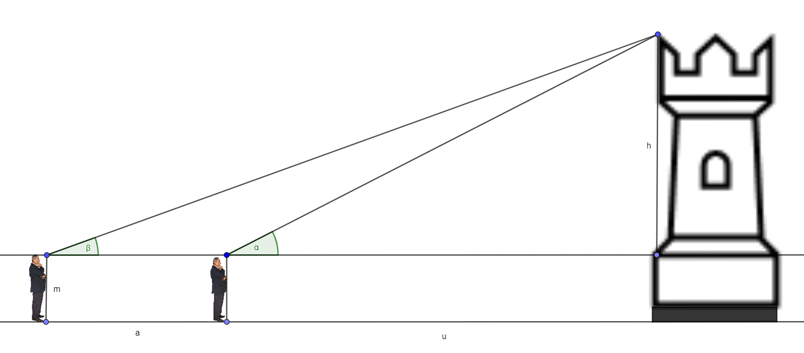

# Skizze zeigen

Dabei haben die Variablen folgende Bedeutung:

- m: Größe der messenden Person (1,9m waren das übrigens)
- a: Abstand der Messungen
- Alpha, Beta: Gemessene Winkel

Unbekannt sind diese Variablen:

- h: Höhe des Turms
- u: Abstand der näheren Messung zum Turm

[Hier geht es zurück zur Übersicht](hilfe)
